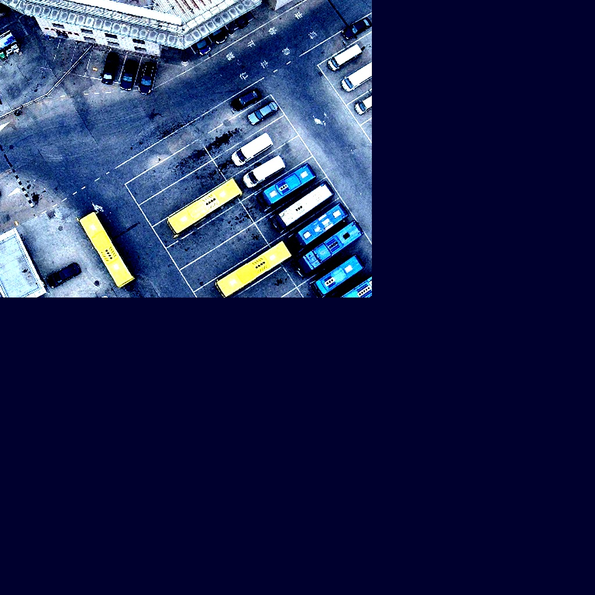
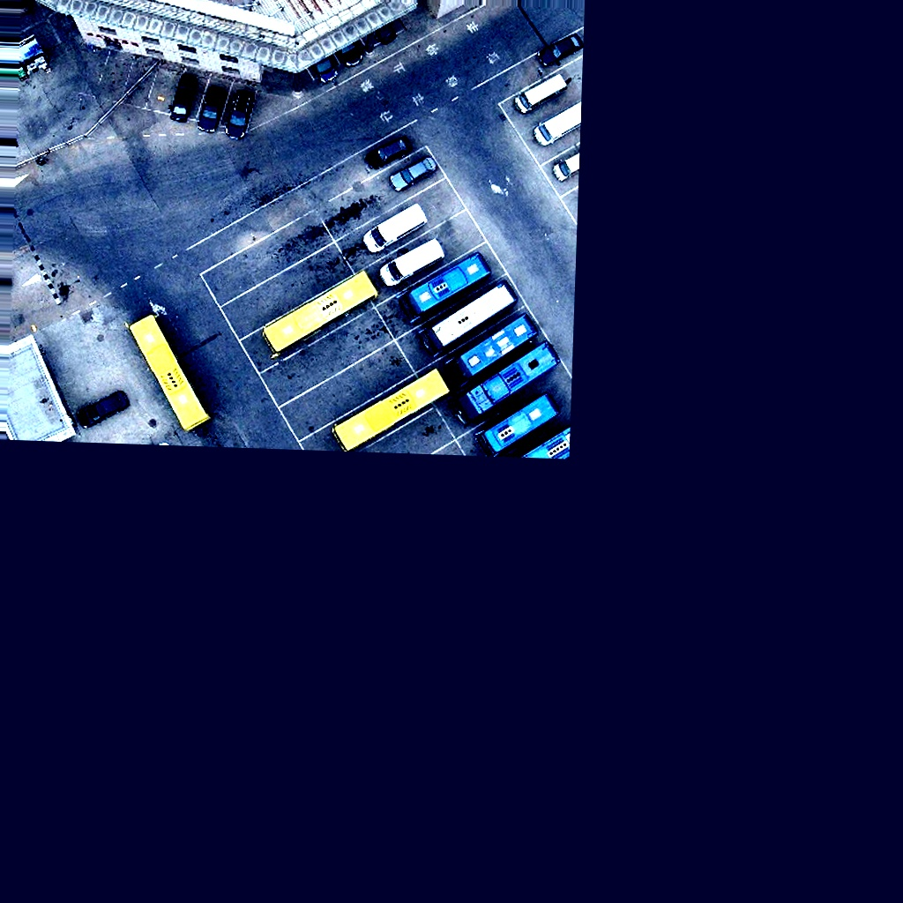

# GAIIC 2024挑战赛

Hello, 这里是GAIIC2024双光无人机视角挑战赛第5名羊了个羊队伍的项目介绍文档

**写在前面**
> 由于我们的团队代码管理全程托管于Github, 而fork的mmdetection的开源性质，因此本代码一直处于public状态, 当前的版本是非常原始的内部实验版本, 整理后的代码将会届时发布在默认的main分支。由于当前代码较为杂乱因此为了快速发布首先整理了本文档, 本文档具体介绍我们比赛中使用的所有增广方案和模型方案（包括失败方案和代码已完成但未进行提交的方案）。

我们假设使用者熟练使用MMdetection， 若需要安装环境请参考该文件中[MMdetection的README部分](#end)，实验中的版本如下[团队合作中存在版本不一致， 以下为A100_80Gx2服务器环境配置，更多实验在H800x8上进行]：
```
mmcv                      2.1.0                    pypi_0    pypi
mmdet                     3.3.0                    pypi_0    pypi
mmengine                  0.10.4                   pypi_0    pypi
tensorboard               2.14.0                   pypi_0    pypi
timm                      0.9.16                   pypi_0    pypi
torch                     2.1.0+cu118              pypi_0    pypi
torchaudio                2.1.0+cu118              pypi_0    pypi
```

## 目录
### 工程结构
代码结构遵循原始mmdetetion代码目录，所有增加内容以新增文件的形式体现，为了兼容双光的数据流和模型输入我们添加了位于```mmdet/datasets```下的各种修改组件：
1) gaiic数据集: 特有的双流Dataset以支持双流数据流结构：```mmdet/datasets/my_coco.py```, ```mmdet/datasets/my_coco_three.py```。
2) 支持双流随机一致性的各种 transforms（数据增强管道）： ```mmdet/datasets/transforms/my_formatting.py```, ```mmdet/datasets/transforms/my_loading.py```, ```mmdet/datasets/transforms/my_transforms_possion.py```, ```mmdet/datasets/transforms/my_transforms.py```, ```mmdet/datasets/transforms/my_wrapper_three.py```, ```mmdet/datasets/transforms/my_wrapper.py```。其中 ```my_transforms``` 包提供本次比赛大部分数据增强手段, ```my_wrapper```包提供双流随机一致性管道包装类。
3) 修改过的各种支持双流的模型（主要为backbone）： ```mmdet/models/backbones/dual_swin_cbnet_pki.py```cbnet的多个版本（详见[PPT](assets/2024GAIIC-羊了个羊.pptx)网络结构图）;```mmdet/models/backbones/dual_swin_dcn.py``` 可变形卷积backbone; ```mmdet/models/backbones/dual_swin.py``` SwinTransformer backbone; ```mmdet/models/backbones/dual_resnet.py```  Resnet backbone; ```mmdet/models/backbones/dual_swin_c2former.py``` C^2Former融合模块backbone（该模块需要超大显存，请启用fairscale）; ```mmdet/models/necks/sfp.py``` 运行DINOv2预训练ViT-L backbone需要使用的neck; 
4) MMDetection 支持双流输入需要的数据预处理：```mmdet/models/data_preprocessors/my_data_preprocessor.py```
5) 为Co-DETR专门设计的支持双流backbone的模型架构：```projects/CO_DETR/codetr/codetr_dual_stream_dual_swin_cbswin.py```支持CBNet的双流模型，有多个版本，最终使用初版; ```projects/CO_DETR/codetr/codetr_dual_stream_dual_swin_pkiv2.py``` PKI架构的多个双流版本; ```projects/CO_DETR/codetr/codetr_dual_stream_reg.py```内嵌多尺度弹性配准网络的双流模型（未提交，可运行） ```projects/CO_DETR/codetr/codetr_dual_stream.py```该架构只能加载普通单流backbone, 作为初期测试使用，运行时会在双流输入分别拷贝两份完全一样的backbone; ```projects/CO_DETR/codetr/codetr_dual_stream_vat.py```该架构支持‘类’虚拟对抗训练（VAT），但实验结果较差，不建议使用。```projects/CO_DETR/codetr/codetr_three_stream.py``` 输入三流的模型架构; ```projects/CO_DETR/codetr/dual_resnet.py```写死backbone的Resnet的双流版本。
6) 其他：```projects/CO_DETR/codetr/registration_net.py``` 简单的基于SpcialTransformNet(STN) 的配准网络。


除此之外我们也尝试过其他架构的模型，对应的配置文件为：
1. ```configs/rtmdet``` RTMDet的双流版本
2. ```configs/dino``` DINO的双流版本
3. ```Yolov9``` Yolov9版本将会独立发布

## 额外实验部分
我们尝试的两阶段分类模型，去噪框架，配准框架等将会以独立仓库发布。

## 如何运行
以最后的最高A榜单模型为例，接下来将会介绍如何开始训练和测试我们的最佳模型
### 数据准备
我们使用了额外数据集`VisDrone2019`和`DroneVehicle`, 请独立下载这两个数据集，并通过以下转换脚本转换为可用数据, 请手动修改python文件内的```root```变量为实际数据集根路径。
###

```bash
python convert_dronevehicle_to_coco.py
python convert_visdrone_to_coco_drop_fcar.py
```

请手动合并赛事数据集和额外数据集。
合并后的数据目录形式需要为下方树状图所示, 其中 `*.json` 文件需要为`COCO`的标注文件格式：
``` shell
`-- data_root_name
    |-- test.json
    |-- train.json
    |-- val.json
    |-- test
        |-- 001.jpg
        |-- 002.jpg
        |-- ...
    |-- train
        |-- 001.jpg
        |-- 002.jpg
        |-- ...
    |-- val
        |-- 001.jpg
        |-- 002.jpg
        |-- ...
```

### 训练
我们使用最佳模型配置文件为例来阐述如何训练:

需要准备预训练权重并下载在项目根目录：
```
wget https://download.openmmlab.com/mmdetection/v3.0/codetr/co_dino_5scale_swin_large_16e_o365tococo-614254c9.pth

wget https://github.com/SwinTransformer/storage/releases/download/v1.0.0/swin_large_patch4_window12_384_22k.pth
```


#### 数据文件路径
请首先检查配置文件是否存在，实验中的最佳配置文件路径如下：
```projects/CO_DETR/configs/codino/co_dino_5scale_r50_lsj_8xb2_1x_gaiic_dual_stream_more_data_albu_with_Vis_3cls_dark_enhance_rotate.py```

修改```dataset_root```为实际数据集存放路径

#### 训练脚本

以单机8卡GPU服务器，config路径为：`path/to/config.py` 的实验环境为例
``` bash
export TORCH_DISTRIBUTED_DEBUG=DETAIL # 启用详细的多卡日志报告
export PORT=25569 # 指定master端口
export CUDA_VISIBLE_DEVICES=0,1,2,3,4,5,6,7 # 指定使用的GPU
./tools/dist_train.sh  \
  path/to/config.py \
  8 # 使用的显卡数量
```
在我们的训练中实际使用的训练脚本为:
``` bash
train_with_Vis_3cls_cbpki.sh
```
可以参考实际硬件情况修改。

### 测试
我们的最佳单模型训练权重文件（对应上述最佳模型配置文件）如下：
链接: https://pan.baidu.com/s/1bdGinK7VRhQ88j92WDY0rA 提取码: hjk4
保存于任意路径，假设保存于：path/to/model.path

在配置文件前添加：
``` python
load_from = "path/to/model.path"
```
以加载训练权重。

#### 测试脚本
以单机双卡GPU服务器，config路径为：`path/to/config.py`， 模型参数路径：`path/to/model.pth` 的实验环境为例
``` bash
export CUDA_VISIBLE_DEVICES=0,1 
./tools/dist_test.sh   \
  path/to/config.py  \
  path/to/model.pth \
  2 \
  --tta # 是否启用TTA
```

我们实验中实际使用的测试脚本为：
```
test.sh
```
可以根据实际情况修改路径。


## 实验结果
### 失败案例
在实验过程中我们尝试了许多失败案例，但是并不一定代表这些策略是无效的。

#### 在线配准（隐/显式）
类似第二名队伍的内嵌配准网络我们实际实验中并没有成功，显式无监督配准网络在`NCC Loss`的目标优化下的配准结果，如下图所示，实验使用的网络架构见：`projects/CO_DETR/codetr/codetr_dual_stream_reg_v2.py` 我们使用了在线的全局小幅度的仿射变换合成原图得到的目标图像来训练该网络 \
 \
 \

对于复杂目标的2d配准效果并不好。

#### 深层监督
使用了类似辅助监督的方式来对其不同层的能力，具体架构见 `projects/CO_DETR/codetr/codetr_dual_stream_dual_swin_pki_deep.py`

#### 离线配准
离线配准的配准策略和效果见[PPT](assets/2024GAIIC-羊了个羊.pptx)说明，由于时间紧张我们没有用配准后图像训练， 该部分代码会独立发布。

#### 后处理
后处理我们只尝试过：检测接2分类（FreightCar和Truck）或6分类网络（5类车辆+背景类）以及移除边界半框和WBF融合
除了WBF有效外全部无效。我们分析是由于分类裁剪的图像丢失了部分全局信息，导致分类网络弱于检测网络。性能比较请见[PPT](assets/2024GAIIC-羊了个羊.pptx)。

#### 自动化的数据清洗或模型抗噪
手动的清洗策略没有实际应用意义，数据清洗我们采用了基于特征的和基于模型置信度以及综合性的去噪框架（代码以及结果将独立发布）。
1. 基于特征的：基于标注宽高比，剔除显然错误的标注数据，详见[PPT](assets/2024GAIIC-羊了个羊.pptx)数据集分析章节
2. 基于模型置信度的：Cleanlab，实际测试效果不佳
3. 基于LLN的去噪和噪声矫正框架：PLC
4. 模型抗噪或增强：这里主要指图像噪声而非标注噪声，我们采用一些强增广进行去噪声，1）全图增强。其中HSV这种Color Space增广，以及Yolo提出的Mosaic并不能提升性能（但是第2，3名重新发现(?)的FastMosaic似乎得到了和我们相反的结论）。2）特征抗噪。见`projects/CO_DETR/codetr/codetr_dual_stream_dual_swin_vat.py`和 VAT 介绍，我们没有采用真正的虚拟对抗训练而是使用了高斯分布的噪声。

### 成功的策略
以下策略是比赛中在A榜上有效策略，但是一些策略可能和数据集和模型架构有一定耦合可能不能在所有数据集和模型上稳定生效。增广方案代码位于 `mmdet/datasets/transforms/my_transforms.py`

#### 非对称增广
由于TIR和RGB的图像存在空间和模态的不一致性，因此在训练过程中做非对称增广（两幅图做略微不同的增广）可以增强泛化性能：
1. 小幅不同的2d仿射变换 （平移缩放旋转）,有利于模型自动学习到全局变换
2. 不同的亮度变换
3. 对TIR做CLAHE，保持训练测试的图像锐度一致性
4. 模糊（Montion or Guassian Blur）
5. RGB使用DarkChannel进行夜间提亮

#### 对称增广和TTA
1. 大幅度的2d仿射变换 （平移缩放旋转）
2. TTA中的Flip操作（也可以认为TTA是模型集成）

#### 模型集成
1. 稳定的性能提升方案，也中可以考虑在Class Head和Box Head进行多种方式融合，通用检测模型的融合方案则建议使用WBF（加权的框融合，Weighted Box Fusion）

#### 较大模型抗噪
1. 清洗数据集和非清洗数据集性能一致，我们推测较大的模型会有更好的抗标注噪声的能力

#### 多模态融合
1. 模态特征级融合(普通Concat, PKI)，建议尝试第三名的融合策略。


### 实验性能指标

#### 消融实验
##### 非对称偏移：RGB 偏移 TIR 无偏移
| 偏移量       | 测试集A榜性能 |
| ------------ | ------------- |
| （-10， 10） | 47.4          |
| （-15， 15） | 48.7          |
| （-20， 20） | 48.0          |

##### 离线配准
| 方法         | 测试集A榜性能  |
| ------------ | -------------- |
| 随机数据偏移 | 53.8%          |
| 离线配准     | 53.3%（-0.5%） |

##### 多模态融合
| 融合方法 | 测试集A榜性能 |
| -------- | ------------- |
| C2former | 49.2%         |
| EAEFNet  | 51.2%         |
| Add      | 52.3%         |

#### 最终性能

| 模型与方法                            | 测试集A榜 MAP   | 测试集B榜 MAP |
| ------------------------------------- | --------------- | ------------- |
| CO-DINO-R50 单光                      | 40.30%          | -             |
| + 双流， 双光                         | 40.7% (+0.4%)   | -             |
| + Swin-L                              | 44.6% (+3.9%)   | -             |
| + object365预训练                     | 46.2% (+1.6%)   | -             |
| + Random Offset                       | 48.2% (+2.0%)   | -             |
| + 额外训练集（VisDrone-DroneVehicle） | 48.7% (+0.5%)   | -             |
| + 3xBlur & 随机光照 &图片压缩         | 51.2% (+1.73%)  | -             |
| +VisDrone2019 3cls 额外数据           | 52.1% (+0.9%)   | -             |
| + 暗通道增强，点光源                  | 52.9% (+0.8%)   | -             |
| + CBPki                               | 53.1% (+0.2%)   | -             |
| +randomrotate                         | 53.18% (+0.08%) | -             |
| +TTA                                  | 53.9% (+0.72%)  | -             |
| +数据清洗 & Visdrone2019伪标签        | -               | 49.12%        |


----
END
----


<div align="center">
  
  <div>&nbsp;</div>
  <div align="center">
    <b><font size="5">OpenMMLab 官网</font></b>
    <sup>
      <a href="https://openmmlab.com">
        <i><font size="4">HOT</font></i>
      </a>
    </sup>
    &nbsp;&nbsp;&nbsp;&nbsp;
    <b><font size="5">OpenMMLab 开放平台</font></b>
    <sup>
      <a href="https://platform.openmmlab.com">
        <i><font size="4">TRY IT OUT</font></i>
      </a>
    </sup>
  </div>
  <div>&nbsp;</div>

[](https://pypi.org/project/mmdet)
[](https://mmdetection.readthedocs.io/en/latest/)
[](https://github.com/open-mmlab/mmdetection/actions)
[](https://codecov.io/gh/open-mmlab/mmdetection)
[](https://github.com/open-mmlab/mmdetection/blob/main/LICENSE)
[](https://github.com/open-mmlab/mmdetection/issues)
[](https://github.com/open-mmlab/mmdetection/issues)
[](https://openxlab.org.cn/apps?search=mmdet)

[📘使用文档](https://mmdetection.readthedocs.io/zh_CN/latest/) |
[🛠️安装教程](https://mmdetection.readthedocs.io/zh_CN/latest/get_started.html) |
[👀模型库](https://mmdetection.readthedocs.io/zh_CN/latest/model_zoo.html) |
[🆕更新日志](https://mmdetection.readthedocs.io/en/latest/notes/changelog.html) |
[🚀进行中的项目](https://github.com/open-mmlab/mmdetection/projects) |
[🤔报告问题](https://github.com/open-mmlab/mmdetection/issues/new/choose)

</div>

<div align="center">


</div>

<div align="center">
  <a href="https://openmmlab.medium.com/" style="text-decoration:none;">
    </a>
  
  <a href="https://discord.com/channels/1037617289144569886/1046608014234370059" style="text-decoration:none;">
    </a>
  
  <a href="https://twitter.com/OpenMMLab" style="text-decoration:none;">
    </a>
  
  <a href="https://www.youtube.com/openmmlab" style="text-decoration:none;">
    </a>
  
  <a href="https://space.bilibili.com/1293512903" style="text-decoration:none;">
    </a>
  
  <a href="https://www.zhihu.com/people/openmmlab" style="text-decoration:none;">
    </a>
</div>

<div align="center">

</div>

## 简介

MMDetection 是一个基于 PyTorch 的目标检测开源工具箱。它是 [OpenMMLab](https://openmmlab.com/) 项目的一部分。

主分支代码目前支持 PyTorch 1.8 及其以上的版本。


<details open>
<summary>主要特性</summary>

- **模块化设计**

  MMDetection 将检测框架解耦成不同的模块组件，通过组合不同的模块组件，用户可以便捷地构建自定义的检测模型

- **支持多种检测任务**

  MMDetection 支持了各种不同的检测任务，包括**目标检测**，**实例分割**，**全景分割**，以及**半监督目标检测**。

- **速度快**

  基本的框和 mask 操作都实现了 GPU 版本，训练速度比其他代码库更快或者相当，包括 [Detectron2](https://github.com/facebookresearch/detectron2), [maskrcnn-benchmark](https://github.com/facebookresearch/maskrcnn-benchmark) 和 [SimpleDet](https://github.com/TuSimple/simpledet)。

- **性能高**

  MMDetection 这个算法库源自于 COCO 2018 目标检测竞赛的冠军团队 *MMDet* 团队开发的代码，我们在之后持续进行了改进和提升。
  新发布的 [RTMDet](configs/rtmdet) 还在实时实例分割和旋转目标检测任务中取得了最先进的成果，同时也在目标检测模型中取得了最佳的的参数量和精度平衡。

</details>

除了 MMDetection 之外，我们还开源了深度学习训练库 [MMEngine](https://github.com/open-mmlab/mmengine) 和计算机视觉基础库 [MMCV](https://github.com/open-mmlab/mmcv)，它们是 MMDetection 的主要依赖。

## 最新进展

💎 **我们已经发布了 MM-Grounding-DINO Swin-B 和 Swin-L 预训练权重，欢迎试用和反馈.**

### 亮点

**v3.3.0** 版本已经在 2024.1.5 发布：

**MM-Grounding-DINO: 轻松涨点，数据到评测全面开源**

Grounding DINO 是一个统一了 2d 开放词汇目标检测和 Phrase Grounding 的检测预训练模型，应用广泛，但是其训练部分并未开源，为此提出了 MM-Grounding-DINO。其不仅作为 Grounding DINO 的开源复现版，MM-Grounding-DINO 基于重新构建的数据类型出发，在探索了不同数据集组合和初始化策略基础上实现了 Grounding DINO 的性能极大提升，并且从多个维度包括 OOD、REC、Phrase Grounding、OVD 和 Finetune 等方面进行评测，充分挖掘 Grounding 预训练优缺点，希望能为后续工作提供启发。

arxiv 技术报告：https://arxiv.org/abs/2401.02361

代码地址: [mm_grounding_dino/README.md](configs/mm_grounding_dino/README.md)

<div align=center>

</div>

我们很高兴向大家介绍我们在实时目标识别任务方面的最新成果 RTMDet，包含了一系列的全卷积单阶段检测模型。 RTMDet 不仅在从 tiny 到 extra-large 尺寸的目标检测模型上实现了最佳的参数量和精度的平衡，而且在实时实例分割和旋转目标检测任务上取得了最先进的成果。 更多细节请参阅[技术报告](https://arxiv.org/abs/2212.07784)。 预训练模型可以在[这里](configs/rtmdet)找到。

[](https://paperswithcode.com/sota/real-time-instance-segmentation-on-mscoco?p=rtmdet-an-empirical-study-of-designing-real)
[](https://paperswithcode.com/sota/object-detection-in-aerial-images-on-dota-1?p=rtmdet-an-empirical-study-of-designing-real)
[](https://paperswithcode.com/sota/object-detection-in-aerial-images-on-hrsc2016?p=rtmdet-an-empirical-study-of-designing-real)

| Task                     | Dataset | AP                                   | FPS(TRT FP16 BS1 3090) |
| ------------------------ | ------- | ------------------------------------ | ---------------------- |
| Object Detection         | COCO    | 52.8                                 | 322                    |
| Instance Segmentation    | COCO    | 44.6                                 | 188                    |
| Rotated Object Detection | DOTA    | 78.9(single-scale)/81.3(multi-scale) | 121                    |

<div align=center>

</div>

## 安装

请参考[快速入门文档](https://mmdetection.readthedocs.io/zh_CN/latest/get_started.html)进行安装。

## 教程

请阅读[概述](https://mmdetection.readthedocs.io/zh_CN/latest/get_started.html)对 MMDetection 进行初步的了解。

为了帮助用户更进一步了解 MMDetection，我们准备了用户指南和进阶指南，请阅读我们的[文档](https://mmdetection.readthedocs.io/zh_CN/latest/)：

- 用户指南

  <details>

  - [训练 & 测试](https://mmdetection.readthedocs.io/zh_CN/latest/user_guides/index.html#train-test)
    - [学习配置文件](https://mmdetection.readthedocs.io/zh_CN/latest/user_guides/config.html)
    - [使用已有模型在标准数据集上进行推理](https://mmdetection.readthedocs.io/en/latest/user_guides/inference.html)
    - [数据集准备](https://mmdetection.readthedocs.io/zh_CN/latest/user_guides/dataset_prepare.html)
    - [测试现有模型](https://mmdetection.readthedocs.io/zh_CN/latest/user_guides/test.html)
    - [在标准数据集上训练预定义的模型](https://mmdetection.readthedocs.io/zh_CN/latest/user_guides/train.html)
    - [在自定义数据集上进行训练](https://mmdetection.readthedocs.io/zh_CN/latest/user_guides/train.html#train-with-customized-datasets)
    - [在标准数据集上训练自定义模型](https://mmdetection.readthedocs.io/zh_CN/latest/user_guides/new_model.html)
    - [模型微调](https://mmdetection.readthedocs.io/zh_CN/latest/user_guides/finetune.html)
    - [提交测试结果](https://mmdetection.readthedocs.io/zh_CN/latest/user_guides/test_results_submission.html)
    - [权重初始化](https://mmdetection.readthedocs.io/zh_CN/latest/user_guides/init_cfg.html)
    - [将单阶段检测器作为 RPN](https://mmdetection.readthedocs.io/zh_CN/latest/user_guides/single_stage_as_rpn.html)
    - [半监督目标检测](https://mmdetection.readthedocs.io/zh_CN/latest/user_guides/semi_det.html)
  - [实用工具](https://mmdetection.readthedocs.io/zh_CN/latest/user_guides/index.html#useful-tools)

  </details>

- 进阶指南

  <details>

  - [基础概念](https://mmdetection.readthedocs.io/zh_CN/latest/advanced_guides/index.html#basic-concepts)
  - [组件定制](https://mmdetection.readthedocs.io/zh_CN/latest/advanced_guides/index.html#component-customization)
  - [How to](https://mmdetection.readthedocs.io/zh_CN/latest/advanced_guides/index.html#how-to)

  </details>

我们提供了检测的 colab 教程 [](demo/MMDet_Tutorial.ipynb) 和 实例分割的 colab 教程 [](demo/MMDet_Tutorial.ipynb)

同时，我们还提供了 [MMDetection 中文解读文案汇总](docs/zh_cn/article.md)

若需要将2.x版本的代码迁移至新版，请参考[迁移文档](https://mmdetection.readthedocs.io/en/latest/migration.html)。

## 基准测试和模型库

测试结果和模型可以在[模型库](docs/zh_cn/model_zoo.md)中找到。

<div align="center">
  <b>算法架构</b>
</div>
<table align="center">
  <tbody>
    <tr align="center" valign="bottom">
      <td>
        <b>Object Detection</b>
      </td>
      <td>
        <b>Instance Segmentation</b>
      </td>
      <td>
        <b>Panoptic Segmentation</b>
      </td>
      <td>
        <b>Other</b>
      </td>
    </tr>
    <tr valign="top">
      <td>
        <ul>
            <li><a href="configs/fast_rcnn">Fast R-CNN (ICCV'2015)</a></li>
            <li><a href="configs/faster_rcnn">Faster R-CNN (NeurIPS'2015)</a></li>
            <li><a href="configs/rpn">RPN (NeurIPS'2015)</a></li>
            <li><a href="configs/ssd">SSD (ECCV'2016)</a></li>
            <li><a href="configs/retinanet">RetinaNet (ICCV'2017)</a></li>
            <li><a href="configs/cascade_rcnn">Cascade R-CNN (CVPR'2018)</a></li>
            <li><a href="configs/yolo">YOLOv3 (ArXiv'2018)</a></li>
            <li><a href="configs/cornernet">CornerNet (ECCV'2018)</a></li>
            <li><a href="configs/grid_rcnn">Grid R-CNN (CVPR'2019)</a></li>
            <li><a href="configs/guided_anchoring">Guided Anchoring (CVPR'2019)</a></li>
            <li><a href="configs/fsaf">FSAF (CVPR'2019)</a></li>
            <li><a href="configs/centernet">CenterNet (CVPR'2019)</a></li>
            <li><a href="configs/libra_rcnn">Libra R-CNN (CVPR'2019)</a></li>
            <li><a href="configs/tridentnet">TridentNet (ICCV'2019)</a></li>
            <li><a href="configs/fcos">FCOS (ICCV'2019)</a></li>
            <li><a href="configs/reppoints">RepPoints (ICCV'2019)</a></li>
            <li><a href="configs/free_anchor">FreeAnchor (NeurIPS'2019)</a></li>
            <li><a href="configs/cascade_rpn">CascadeRPN (NeurIPS'2019)</a></li>
            <li><a href="configs/foveabox">Foveabox (TIP'2020)</a></li>
            <li><a href="configs/double_heads">Double-Head R-CNN (CVPR'2020)</a></li>
            <li><a href="configs/atss">ATSS (CVPR'2020)</a></li>
            <li><a href="configs/nas_fcos">NAS-FCOS (CVPR'2020)</a></li>
            <li><a href="configs/centripetalnet">CentripetalNet (CVPR'2020)</a></li>
            <li><a href="configs/autoassign">AutoAssign (ArXiv'2020)</a></li>
            <li><a href="configs/sabl">Side-Aware Boundary Localization (ECCV'2020)</a></li>
            <li><a href="configs/dynamic_rcnn">Dynamic R-CNN (ECCV'2020)</a></li>
            <li><a href="configs/detr">DETR (ECCV'2020)</a></li>
            <li><a href="configs/paa">PAA (ECCV'2020)</a></li>
            <li><a href="configs/vfnet">VarifocalNet (CVPR'2021)</a></li>
            <li><a href="configs/sparse_rcnn">Sparse R-CNN (CVPR'2021)</a></li>
            <li><a href="configs/yolof">YOLOF (CVPR'2021)</a></li>
            <li><a href="configs/yolox">YOLOX (CVPR'2021)</a></li>
            <li><a href="configs/deformable_detr">Deformable DETR (ICLR'2021)</a></li>
            <li><a href="configs/tood">TOOD (ICCV'2021)</a></li>
            <li><a href="configs/ddod">DDOD (ACM MM'2021)</a></li>
            <li><a href="configs/rtmdet">RTMDet (ArXiv'2022)</a></li>
            <li><a href="configs/conditional_detr">Conditional DETR (ICCV'2021)</a></li>
            <li><a href="configs/dab_detr">DAB-DETR (ICLR'2022)</a></li>
            <li><a href="configs/dino">DINO (ICLR'2023)</a></li>
            <li><a href="configs/glip">GLIP (CVPR'2022)</a></li>
            <li><a href="configs/ddq">DDQ (CVPR'2023)</a></li>
            <li><a href="projects/DiffusionDet">DiffusionDet (ArXiv'2023)</a></li>
            <li><a href="projects/EfficientDet">EfficientDet (CVPR'2020)</a></li>
            <li><a href="projects/ViTDet">ViTDet (ECCV'2022)</a></li>
            <li><a href="projects/Detic">Detic (ECCV'2022)</a></li>
            <li><a href="projects/CO-DETR">CO-DETR (ICCV'2023)</a></li>
      </ul>
      </td>
      <td>
        <ul>
          <li><a href="configs/mask_rcnn">Mask R-CNN (ICCV'2017)</a></li>
          <li><a href="configs/cascade_rcnn">Cascade Mask R-CNN (CVPR'2018)</a></li>
          <li><a href="configs/ms_rcnn">Mask Scoring R-CNN (CVPR'2019)</a></li>
          <li><a href="configs/htc">Hybrid Task Cascade (CVPR'2019)</a></li>
          <li><a href="configs/yolact">YOLACT (ICCV'2019)</a></li>
          <li><a href="configs/instaboost">InstaBoost (ICCV'2019)</a></li>
          <li><a href="configs/solo">SOLO (ECCV'2020)</a></li>
          <li><a href="configs/point_rend">PointRend (CVPR'2020)</a></li>
          <li><a href="configs/detectors">DetectoRS (ArXiv'2020)</a></li>
          <li><a href="configs/solov2">SOLOv2 (NeurIPS'2020)</a></li>
          <li><a href="configs/scnet">SCNet (AAAI'2021)</a></li>
          <li><a href="configs/queryinst">QueryInst (ICCV'2021)</a></li>
          <li><a href="configs/mask2former">Mask2Former (ArXiv'2021)</a></li>
          <li><a href="configs/condinst">CondInst (ECCV'2020)</a></li>
          <li><a href="projects/SparseInst">SparseInst (CVPR'2022)</a></li>
          <li><a href="configs/rtmdet">RTMDet (ArXiv'2022)</a></li>
          <li><a href="configs/boxinst">BoxInst (CVPR'2021)</a></li>
          <li><a href="projects/ConvNeXt-V2">ConvNeXt-V2 (Arxiv'2023)</a></li>
        </ul>
      </td>
      <td>
        <ul>
          <li><a href="configs/panoptic_fpn">Panoptic FPN (CVPR'2019)</a></li>
          <li><a href="configs/maskformer">MaskFormer (NeurIPS'2021)</a></li>
          <li><a href="configs/mask2former">Mask2Former (ArXiv'2021)</a></li>
          <li><a href="configs/XDecoder">XDecoder (CVPR'2023)</a></li>
        </ul>
      </td>
      <td>
        </ul>
          <li><b>Contrastive Learning</b></li>
        <ul>
        <ul>
          <li><a href="configs/selfsup_pretrain">SwAV (NeurIPS'2020)</a></li>
          <li><a href="configs/selfsup_pretrain">MoCo (CVPR'2020)</a></li>
          <li><a href="configs/selfsup_pretrain">MoCov2 (ArXiv'2020)</a></li>
        </ul>
        </ul>
        </ul>
          <li><b>Distillation</b></li>
        <ul>
        <ul>
          <li><a href="configs/ld">Localization Distillation (CVPR'2022)</a></li>
          <li><a href="configs/lad">Label Assignment Distillation (WACV'2022)</a></li>
        </ul>
        </ul>
          <li><b>Semi-Supervised Object Detection</b></li>
        <ul>
        <ul>
          <li><a href="configs/soft_teacher">Soft Teacher (ICCV'2021)</a></li>
        </ul>
        </ul>
      </ul>
      </td>
    </tr>
</td>
    </tr>
  </tbody>
</table>

<div align="center">
  <b>模块组件</b>
</div>
<table align="center">
  <tbody>
    <tr align="center" valign="bottom">
      <td>
        <b>Backbones</b>
      </td>
      <td>
        <b>Necks</b>
      </td>
      <td>
        <b>Loss</b>
      </td>
      <td>
        <b>Common</b>
      </td>
    </tr>
    <tr valign="top">
      <td>
      <ul>
        <li>VGG (ICLR'2015)</li>
        <li>ResNet (CVPR'2016)</li>
        <li>ResNeXt (CVPR'2017)</li>
        <li>MobileNetV2 (CVPR'2018)</li>
        <li><a href="configs/hrnet">HRNet (CVPR'2019)</a></li>
        <li><a href="configs/empirical_attention">Generalized Attention (ICCV'2019)</a></li>
        <li><a href="configs/gcnet">GCNet (ICCVW'2019)</a></li>
        <li><a href="configs/res2net">Res2Net (TPAMI'2020)</a></li>
        <li><a href="configs/regnet">RegNet (CVPR'2020)</a></li>
        <li><a href="configs/resnest">ResNeSt (ArXiv'2020)</a></li>
        <li><a href="configs/pvt">PVT (ICCV'2021)</a></li>
        <li><a href="configs/swin">Swin (CVPR'2021)</a></li>
        <li><a href="configs/pvt">PVTv2 (ArXiv'2021)</a></li>
        <li><a href="configs/resnet_strikes_back">ResNet strikes back (ArXiv'2021)</a></li>
        <li><a href="configs/efficientnet">EfficientNet (ArXiv'2021)</a></li>
        <li><a href="configs/convnext">ConvNeXt (CVPR'2022)</a></li>
        <li><a href="projects/ConvNeXt-V2">ConvNeXtv2 (ArXiv'2023)</a></li>
      </ul>
      </td>
      <td>
      <ul>
        <li><a href="configs/pafpn">PAFPN (CVPR'2018)</a></li>
        <li><a href="configs/nas_fpn">NAS-FPN (CVPR'2019)</a></li>
        <li><a href="configs/carafe">CARAFE (ICCV'2019)</a></li>
        <li><a href="configs/fpg">FPG (ArXiv'2020)</a></li>
        <li><a href="configs/groie">GRoIE (ICPR'2020)</a></li>
        <li><a href="configs/dyhead">DyHead (CVPR'2021)</a></li>
      </ul>
      </td>
      <td>
        <ul>
          <li><a href="configs/ghm">GHM (AAAI'2019)</a></li>
          <li><a href="configs/gfl">Generalized Focal Loss (NeurIPS'2020)</a></li>
          <li><a href="configs/seesaw_loss">Seasaw Loss (CVPR'2021)</a></li>
        </ul>
      </td>
      <td>
        <ul>
          <li><a href="configs/faster_rcnn/faster_rcnn_r50_fpn_ohem_1x_coco.py">OHEM (CVPR'2016)</a></li>
          <li><a href="configs/gn">Group Normalization (ECCV'2018)</a></li>
          <li><a href="configs/dcn">DCN (ICCV'2017)</a></li>
          <li><a href="configs/dcnv2">DCNv2 (CVPR'2019)</a></li>
          <li><a href="configs/gn+ws">Weight Standardization (ArXiv'2019)</a></li>
          <li><a href="configs/pisa">Prime Sample Attention (CVPR'2020)</a></li>
          <li><a href="configs/strong_baselines">Strong Baselines (CVPR'2021)</a></li>
          <li><a href="configs/resnet_strikes_back">Resnet strikes back (ArXiv'2021)</a></li>
        </ul>
      </td>
    </tr>
</td>
    </tr>
  </tbody>
</table>

我们在[基于 MMDetection 的项目](./docs/zh_cn/notes/projects.md)中列举了一些其他的支持的算法。

## 常见问题

请参考 [FAQ](docs/zh_cn/notes/faq.md) 了解其他用户的常见问题。

## 贡献指南

我们感谢所有的贡献者为改进和提升 MMDetection 所作出的努力。我们将正在进行中的项目添加进了[GitHub Projects](https://github.com/open-mmlab/mmdetection/projects)页面，非常欢迎社区用户能参与进这些项目中来。请参考[贡献指南](.github/CONTRIBUTING.md)来了解参与项目贡献的相关指引。

## 致谢

MMDetection 是一款由来自不同高校和企业的研发人员共同参与贡献的开源项目。我们感谢所有为项目提供算法复现和新功能支持的贡献者，以及提供宝贵反馈的用户。 我们希望这个工具箱和基准测试可以为社区提供灵活的代码工具，供用户复现已有算法并开发自己的新模型，从而不断为开源社区提供贡献。

## 引用

如果你在研究中使用了本项目的代码或者性能基准，请参考如下 bibtex 引用 MMDetection。

```
@article{mmdetection,
  title   = {{MMDetection}: Open MMLab Detection Toolbox and Benchmark},
  author  = {Chen, Kai and Wang, Jiaqi and Pang, Jiangmiao and Cao, Yuhang and
             Xiong, Yu and Li, Xiaoxiao and Sun, Shuyang and Feng, Wansen and
             Liu, Ziwei and Xu, Jiarui and Zhang, Zheng and Cheng, Dazhi and
             Zhu, Chenchen and Cheng, Tianheng and Zhao, Qijie and Li, Buyu and
             Lu, Xin and Zhu, Rui and Wu, Yue and Dai, Jifeng and Wang, Jingdong
             and Shi, Jianping and Ouyang, Wanli and Loy, Chen Change and Lin, Dahua},
  journal= {arXiv preprint arXiv:1906.07155},
  year={2019}
}
```

## 开源许可证

该项目采用 [Apache 2.0 开源许可证](LICENSE)。

## OpenMMLab 的其他项目

- [MMEngine](https://github.com/open-mmlab/mmengine): OpenMMLab 深度学习模型训练基础库
- [MMCV](https://github.com/open-mmlab/mmcv): OpenMMLab 计算机视觉基础库
- [MMPreTrain](https://github.com/open-mmlab/mmpretrain): OpenMMLab 深度学习预训练工具箱
- [MMagic](https://github.com/open-mmlab/mmagic): OpenMMLab 新一代人工智能内容生成（AIGC）工具箱
- [MMDetection](https://github.com/open-mmlab/mmdetection): OpenMMLab 目标检测工具箱
- [MMDetection3D](https://github.com/open-mmlab/mmdetection3d): OpenMMLab 新一代通用 3D 目标检测平台
- [MMRotate](https://github.com/open-mmlab/mmrotate): OpenMMLab 旋转框检测工具箱与测试基准
- [MMYOLO](https://github.com/open-mmlab/mmyolo): OpenMMLab YOLO 系列工具箱与测试基准
- [MMSegmentation](https://github.com/open-mmlab/mmsegmentation): OpenMMLab 语义分割工具箱
- [MMOCR](https://github.com/open-mmlab/mmocr): OpenMMLab 全流程文字检测识别理解工具包
- [MMPose](https://github.com/open-mmlab/mmpose): OpenMMLab 姿态估计工具箱
- [MMHuman3D](https://github.com/open-mmlab/mmhuman3d): OpenMMLab 人体参数化模型工具箱与测试基准
- [MMSelfSup](https://github.com/open-mmlab/mmselfsup): OpenMMLab 自监督学习工具箱与测试基准
- [MMRazor](https://github.com/open-mmlab/mmrazor): OpenMMLab 模型压缩工具箱与测试基准
- [MMFewShot](https://github.com/open-mmlab/mmfewshot): OpenMMLab 少样本学习工具箱与测试基准
- [MMAction2](https://github.com/open-mmlab/mmaction2): OpenMMLab 新一代视频理解工具箱
- [MMTracking](https://github.com/open-mmlab/mmtracking): OpenMMLab 一体化视频目标感知平台
- [MMFlow](https://github.com/open-mmlab/mmflow): OpenMMLab 光流估计工具箱与测试基准
- [MMEditing](https://github.com/open-mmlab/mmediting): OpenMMLab 图像视频编辑工具箱
- [MMGeneration](https://github.com/open-mmlab/mmgeneration): OpenMMLab 图片视频生成模型工具箱
- [MMDeploy](https://github.com/open-mmlab/mmdeploy): OpenMMLab 模型部署框架
- [MIM](https://github.com/open-mmlab/mim): OpenMMlab 项目、算法、模型的统一入口
- [MMEval](https://github.com/open-mmlab/mmeval): 统一开放的跨框架算法评测库
- [Playground](https://github.com/open-mmlab/playground): 收集和展示 OpenMMLab 相关的前沿、有趣的社区项目

## 欢迎加入 OpenMMLab 社区

扫描下方的二维码可关注 OpenMMLab 团队的 [知乎官方账号](https://www.zhihu.com/people/openmmlab)，扫描下方微信二维码添加喵喵好友，进入 MMDectection 微信交流社群。【加好友申请格式：研究方向+地区+学校/公司+姓名】

<div align="center">
  
</div>

我们会在 OpenMMLab 社区为大家

- 📢 分享 AI 框架的前沿核心技术
- 💻 解读 PyTorch 常用模块源码
- 📰 发布 OpenMMLab 的相关新闻
- 🚀 介绍 OpenMMLab 开发的前沿算法
- 🏃 获取更高效的问题答疑和意见反馈
- 🔥 提供与各行各业开发者充分交流的平台

干货满满 📘，等你来撩 💗，OpenMMLab 社区期待您的加入 👬
